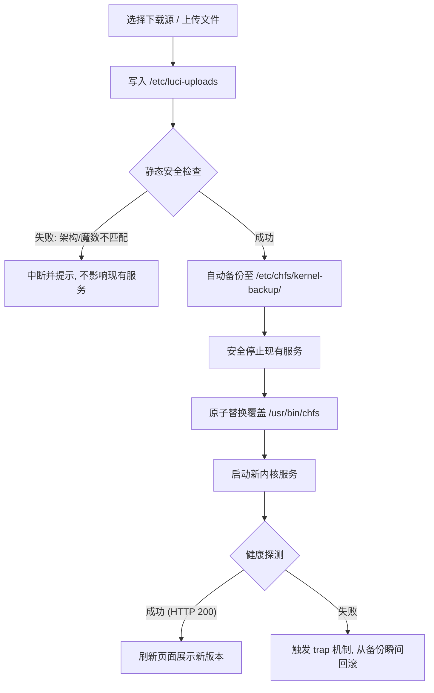

<div align="center">

# luci-app-chfs

**适用于 OpenWrt / ImmortalWrt 的 [chfs](http://iscute.cn/chfs) (CuteHttpFileServer) 现代图形化管理插件**

[](#)
[](#)
[](#)
[](#)
[](#)

*基于 LuCI 原生 CSS 变量设计，无缝自适应明暗主题；前后端采用现代架构（客户端 JS 渲染 + ucode 后端），杜绝假状态与多余开销。*

---

</div>

## 📌 核心特性

- ⚡ **硬核真实状态探测**：拒绝虚假前端开关，全量状态基于底层探测（`pgrep` 运行检测、`/proc/net/tcp` 端口监听、`curl PROPFIND` WebDAV 端点探测）。
- 🔗 **一键直达 WebUI**：直观展示 chfs 前端入口，自动识别并拼接**当前运行期真实生效**的协议与端口（支持 HTTPS/端口偏差告警）。
- 📁 **精细化账户控制**：内置图形化账户管理，支持针对多路径粒度的权限划分（`禁止访问` / `只读` / `读写` / `完全控制`）。
- 🌐 **原生 WebDAV 支持**：完整兼容 chfs 1.10+ 内置 WebDAV，状态页一键复制挂载链接。
- 🛠️ **完整内核生命周期**：独立管理标签页，支持在线检测下载（多镜像代理白名单）与本地上传，提供 ELF 架构自动匹配、安装前自动备份与原子故障回滚。

---

## ⚡ 快速安装

根据系统包管理器格式选择安装指令（菜单位于 **网络存储 (NAS) → chfs 文件共享**）：

### 方式 A：apk 系统 (ImmortalWrt / OpenWrt SNAPSHOT)

```sh
apk add --allow-untrusted ./chfs-3.1-r1.apk
apk add --allow-untrusted ./luci-app-chfs-1.0.0-r1.apk
apk add --allow-untrusted ./luci-i18n-chfs-zh-cn-*.apk

# 清除缓存并重载 RPC 服务
rm -f /tmp/luci-indexcache*; rm -rf /tmp/luci-modulecache/
/etc/init.d/rpcd reload

```

### 方式 B：ipk 系统 (OpenWrt 24.10.x)

```sh
opkg install ./chfs-3.1-r1.ipk
opkg install ./luci-app-chfs-1.0.0-r1.ipk
opkg install ./luci-i18n-chfs-zh-cn-*.ipk

# 清除缓存并重载 RPC 服务
rm -f /tmp/luci-indexcache*; rm -rf /tmp/luci-modulecache/
/etc/init.d/rpcd reload

```

---

## ⚙️ 配置参考

UCI 配置文件为 `/etc/config/chfs`，由 init 脚本在启动时自动渲染为 `/var/etc/chfs.ini`。

### 核心参数映射

| UCI 字段 | 类型 / 范围 | 默认值 | 作用说明 |
| --- | --- | --- | --- |
| `enabled` | `0` | `1` | `0` | 开机自启与服务总开关 |
| `port` | `1 - 65535` | `8080` | HTTP / WebDAV 共享监听端口 |
| `path` | 路径字符串 | - | 共享根目录，支持使用 `|` 分隔多个路径 |
| `run_as` | `root` | `nobody` | `nobody` | 进程安全执行身份 |
| `anonymous` | `0` | `1` | `1` | 允许 guest 访客身份匿名访问 |
| `allow` | IP / CIDR | - | 客户端 IP 白名单（多项用 `|` 分隔，留空不限制） |
| `folder_download` | `disable` | `leaf` | `enable` | `leaf` | 目录打包下载策略 |
| `file_remove` | `1` | `2` | `3` | `1` | 删除策略：`1` 永久 / `2` chfs 回收站 / `3` 系统回收站 |
| `image_preview` | `0` | `1` | `1` | 是否开启图片缩略图预加载 |
| `ssl_cert` / `ssl_key` | 文件绝对路径 | - | HTTPS 证书与密钥（**两者皆填写**时生效） |
| `log_dir` | 目录路径 | - | 操作日志存储目录（留空禁用） |
| `session_timeout` | `1 - 1440` (分钟) | - | 会话有效时间 |

### 账户段配置范例

```uci
config account
    option name 'admin'
    option password 'yourpassword'
    option rule_default 'w'       # 默认权限: none / r / w / d
    list rule_r '/public'         # /public 设为只读
    list rule_w '/upload'         # /upload 允许读写
    list rule_d 'none'            # 禁用删除权限

```

> [!NOTE]
> `guest` 为内置只读访客账户，用于匿名访问场景，界面已做安全保护**不可删除**。

---

## 🧭 系统设计与运行机制

### 1. WebUI 动态跳转解析逻辑

主界面的跳转链接根据当前运行事实动态组装（`协议://主机:端口/`），彻底杜绝脏配置造成的 404：

```
[LuCI 前端: hostname]  ──┐
[ini 解析: ssl.cert]   ──┼──> [ 真实生效 WebUI 链接 ] ──> 新标签页一键跳转
[ini 解析: port=]      ──┘

```

* **协议探测**：运行中检测 `/var/etc/chfs.ini` 行首 `ssl.cert=` 是否存在；未运行时取 UCI 配置中的双证书项。
* **端口校准**：运行中直接抓取 ini 内的 `port=`，若用户修改了端口但未重载服务，前端将呈现当前**实际监听端口**并附带**不一致告警提示**。
* **边界防误判**：正则表达式强制使用 `(^|\n)` 锚定行首，避免页面公告或目录名称包含 `ssl.cert=` 时触发误判。

### 2. 内核安全替换流程

独立标签页支持一键更新或手动上传内核，整体采用**事务式安全升级策略**：



---

## 🏗️ 编译与源码架构

```
.
├── .github/workflows/
│   ├── build.yml                         # 云编译：apk/ipk × arm64/amd64 四矩阵构建
│   └── release.yml                       # 手动工作流：向已有 Release 追加内核二进制资产
├── chfs/                                 # chfs 二进制包封装
│   ├── Makefile                          # 构建逻辑（优先预置，回退上游）
│   ├── extract-bin.sh                    # 二进制解压与规范化清洗
│   ├── bin-manifest.txt                  # 架构、体积与 sha256 校验清单
│   └── bin/                              # 预置二进制库（跳过外部下载）
│       ├── SHA256SUMS                    # 校验值列表
│       ├── arm64/chfs                    # 对应 aarch64
│       └── amd64/chfs                    # 对应 x86_64
├── tools/fetch-chfs.py                   # 自动化抓取上游二进制并同步清单
└── luci-app-chfs/                        # LuCI 现代架构应用源码
    ├── Makefile
    ├── htdocs/luci-static/resources/view/chfs/
    │   ├── main.js                       # 主配置视图
    │   ├── accounts.js                   # 账户管理视图
    │   ├── status.js                     # 运行状态视图
    │   ├── kernel.js                     # 内核升级与回滚管理
    │   └── chfs.css                      # 适配主题变量的自定义样式
    ├── po/zh_Hans/luci-app-chfs.po        # 简体中文本地化字典
    └── root/
        ├── etc/config/chfs               # UCI 默认定义
        ├── etc/init.d/chfs               # procd 服务脚本 (UCI -> ini 渲染)
        ├── etc/uci-defaults/99-luci-app-chfs
        └── usr/share/
            ├── luci/menu.d/              # 菜单挂载 (网络存储)
            ├── rpcd/acl.d/               # ACL 鉴权规则
            └── rpcd/ucode/luci.chfs      # ucode 后端 (提供 16 个 ubus RPC 接口)

```

### 本地编译指令

```sh
# 1. 复制源码包至 OpenWrt SDK
cp -r chfs <openwrt>/package/
cp -r luci-app-chfs <openwrt>/package/

# 2. 先构建 luci-base host 工具 (生成必须的 po2lmo 与 jsmin)
make package/luci-base/host/compile V=s

# 3. 编译应用包 (可配置关闭压缩提速)
make package/chfs/compile V=s
make package/luci-app-chfs/compile V=s \
    LUCI_MINIFY_JS=0 LUCI_MINIFY_CSS=0

```

* **关于 `po2lmo**`：`luci-base/src/Makefile` 内嵌 `contrib/lemon.c`，无需宿主机环境预装 lemon 即可编译。产物存放于 `staging_dir/hostpkg/bin/`。云编译环境会自动向 `staging_dir/host/bin/` 创建软链接以兼容 `luci.mk`。
* **跳过上游下载的正确姿势**：不可设置 `PKG_SKIP_DOWNLOAD`（会被 `include/package.mk` 覆盖），正确方式是在预置文件命中时将 `PKG_SOURCE_URL` **置空**。
* **上游连接规范**：上游 `iscute.cn` 的 HTTPS 证书长期过期，必须使用 `http://` 避免触发 SSL 握手阻断。

---

## ⚠️ 关键注意事项与排坑指南

> [!CAUTION]
> **空路径回退风险**：
> 当配置中的共享路径在设备上不存在时（如移动硬盘未挂载成功），chfs 进程会默认回退至**自身所在目录**（即 `/usr/bin`）作为共享根目录！此行为将导致系统二进制目录直接在网络中暴露。保存配置时请务必核验挂载点真实性。

> [!WARNING]
> **内核备份堆积**：
> 内核管理模块备份位于 `/etc/chfs/kernel-backup`，每次安装新内核均会生成完整快照，且不会做去重或数量上限回收（4 次操作约占用 32 MB 空间）。小容量闪存设备请定期手动清理旧备份。

1. **BusyBox 工具链缺失**：路由器环境中 BusyBox 不含 `install` 命令。原子替换统一采用 `chmod 0755` + `mv -f` 实现。
2. **ucode 语言陷阱**：
* `'use strict'` 下不存在全局 `undefined`，访问会抛出运行时错误；判断空值请使用 `=== null`。
* 自定义函数必须声明在调用代码之前，ucode **不具备变量与函数声明提升机制**。


3. **LuCI 视图组件坑位**：
* `E('button')` 生成的 DOM 默认 `type="submit"`，若放置在 form 内会导致整个页面刷新，自建交互按钮务必显式声明 `type="button"`。
* 避免使用 `cbi-button-apply` 类名，否则会被第三方主题（如 Mint 主题）无条件绑定保存-重载逻辑，导致实际点击事件被拦截。请统一使用 `cbi-button-action`。


4. **国际化哈希失效**：
* 源码中的 `_()` 必须使用**英文 msgid**。若使用中文作为键名，`po2lmo` 会在 `key_id == val_id` 时跳过索引构建，导致中文翻译大规模丢失。


---

## 📦 云端流水线与制品架构

项目通过 GitHub Actions 矩阵生成 4 类构建制品：

| 构建 Artifact 名称 | 封装格式 | 对应系统基底 | 适配目标平台 |
| --- | --- | --- | --- |
| `packages-apk-aarch64_cortex-a53` | **apk** | ImmortalWrt SNAPSHOT | mediatek/filogic (ARM64) |
| `packages-apk-x86_64` | **apk** | ImmortalWrt SNAPSHOT | x86/64 |
| `packages-ipk-aarch64_cortex-a53` | **ipk** | OpenWrt 24.10.x | mediatek/filogic (ARM64) |
| `packages-ipk-x86_64` | **ipk** | OpenWrt 24.10.x | x86/64 |

> [!TIP]
> **Release 竞态避免机制**：打 `v*` tag 时由 `build.yml` 独占创建 Release 并上传基础包；随后的内核二进制由 `release.yml` 通过手动调度（输入指定 tag）追加资产，规避 GitHub API 422 冲突。
