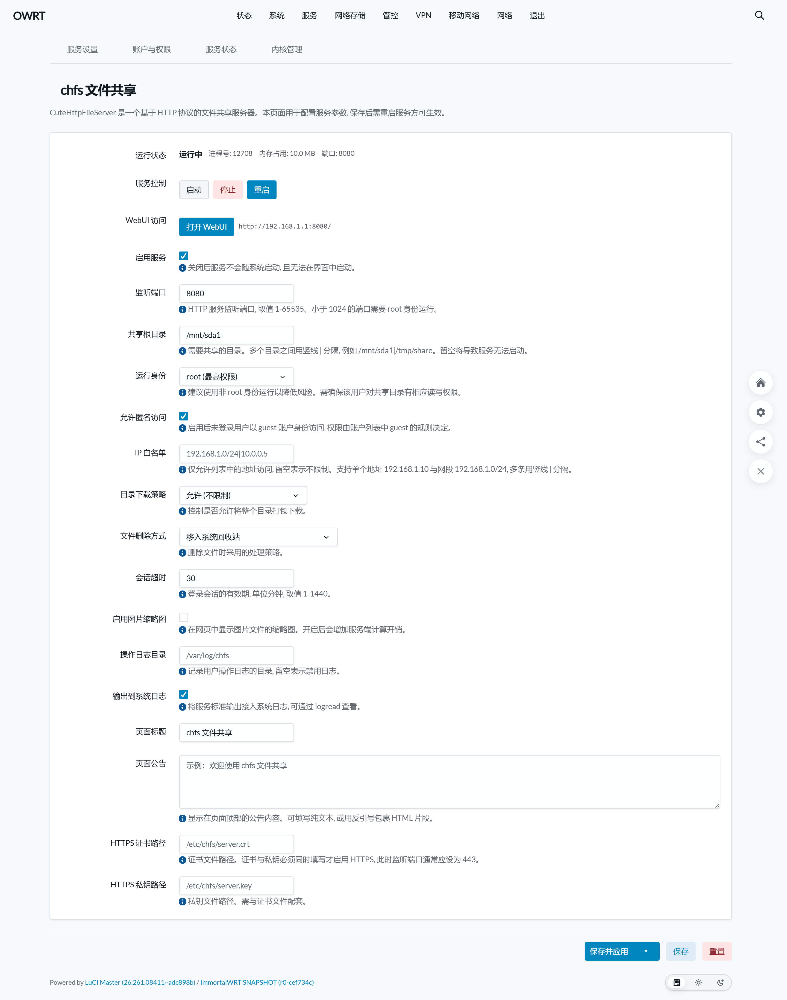
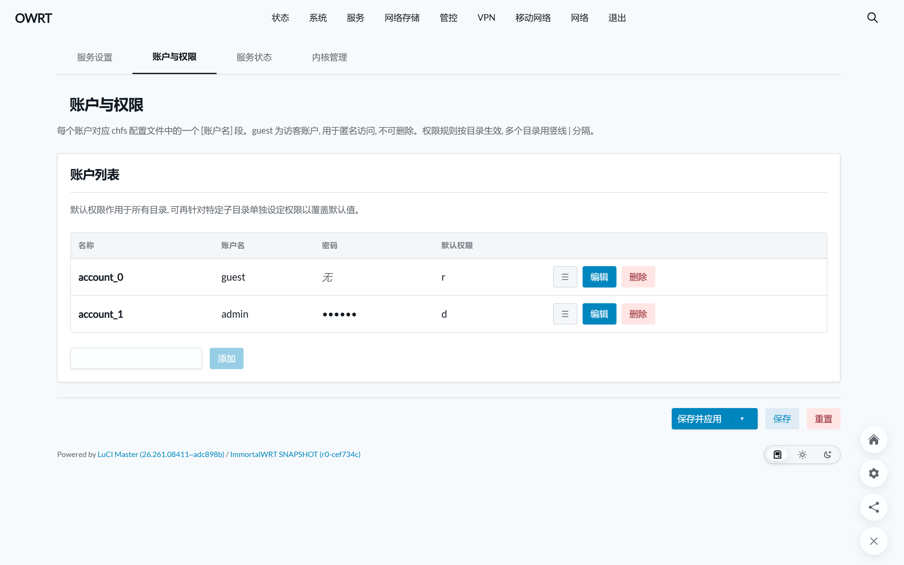
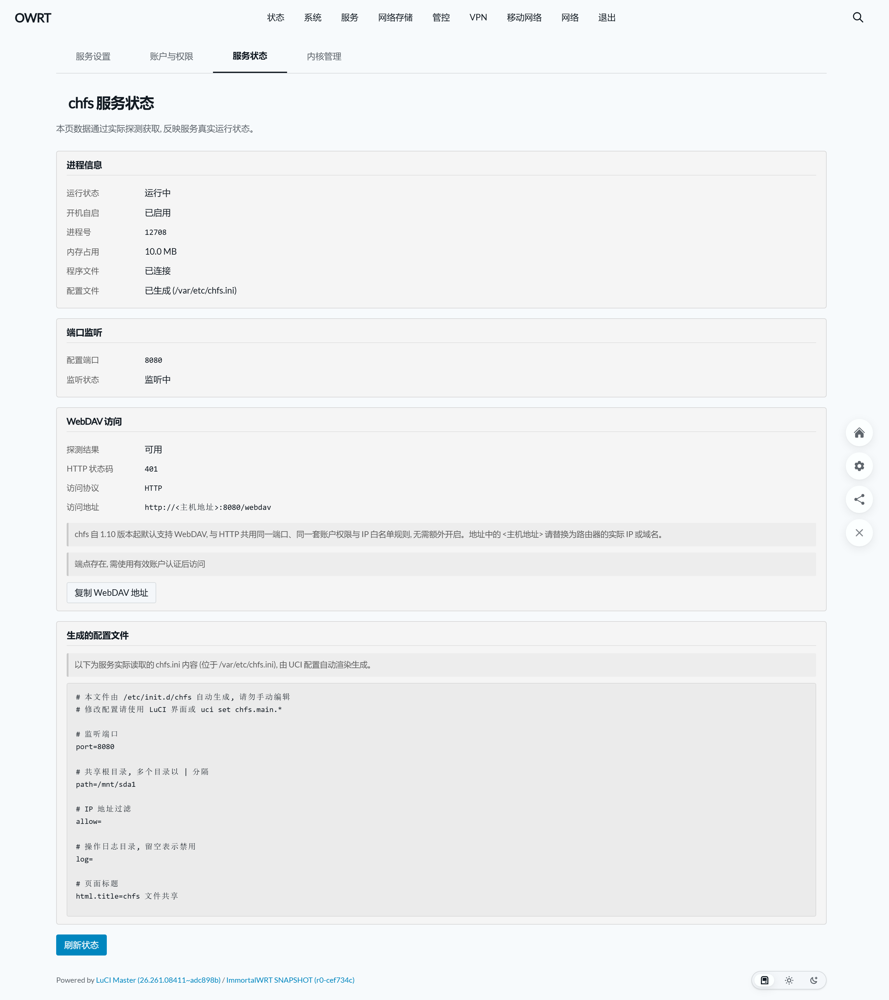
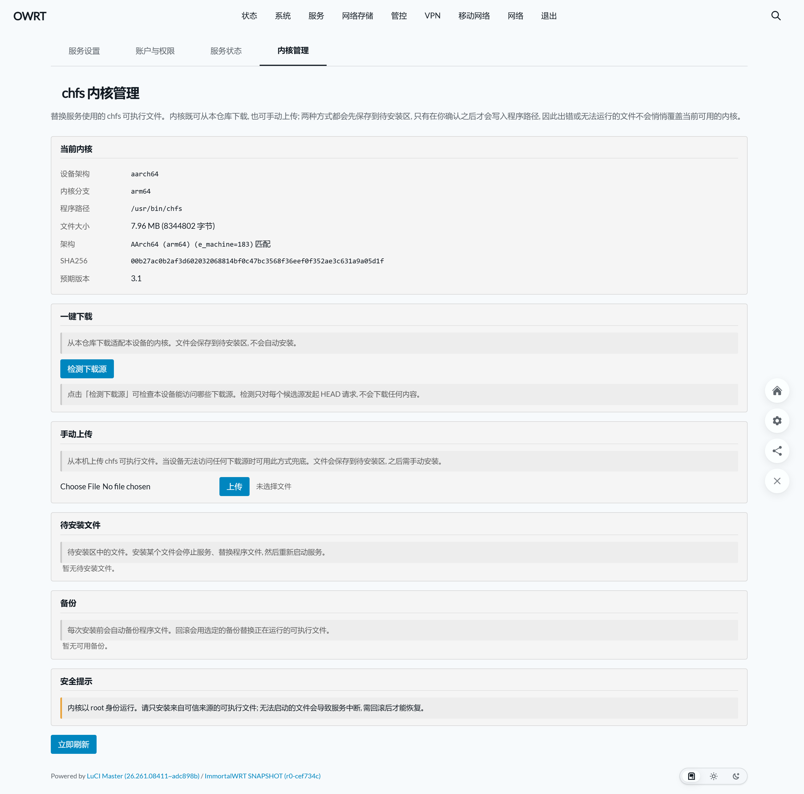
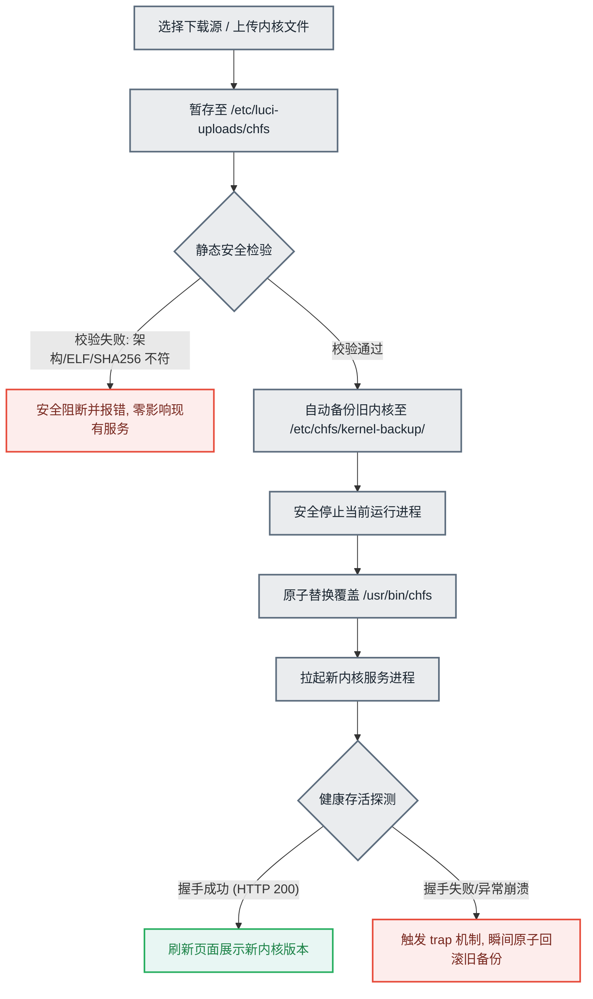

<div align="center">

# 🚀 luci-app-chfs

**适用于 OpenWrt / ImmortalWrt 的 [chfs](http://iscute.cn/chfs) (CuteHttpFileServer) 现代化图形管理控制台**

[-blue?style=flat-square&logo=git&logoColor=white)](CHANGELOG.md)
[](https://github.com/LianXia233/luci-app-chfs/actions/workflows/build.yml)
[](https://openwrt.org/)
[](https://immortalwrt.org/)
[](#-系统设计与运行机制)
[](#-快速安装)
[](#-快速安装)
[](LICENSE)

<p align="center">
  <b>基于 LuCI 原生 CSS 变量设计 · 完美自适应深浅色主题 · 纯真机状态底层探测</b><br>
  多路径细粒度权限管控 · 原生 WebDAV 协议栈支持 · 事务级内核热升级与故障原子回滚
</p>

</div>

---

> [!NOTE]
> **💡 项目简介**
>
> **chfs (CuteHttpFileServer)** 是一款极其轻量、高效且功能强大的跨平台 HTTP / WebDAV 文件共享服务器。  
> 本项目为 OpenWrt / ImmortalWrt 提供了现代化的 LuCI 控制中心，采用**客户端 JavaScript 异步渲染 + 服务端 ucode RPC 代理**的现代解耦架构，彻底杜绝假状态开关，带来原生、丝滑的配置与文件服务管理体验。

---

## 📸 界面预览

截图均取自 ImmortalWrt SNAPSHOT 实机（搭载 LuCI Master 及 Aurora 主题），展示 4 大核心视图。截图中 `admin` 为演示用自行添加的账户，默认配置不预置固定口令账户。

| ⚙️ 服务主设置 | 👥 账户与权限细分 |
|:---:|:---:|
|  |  |
| **📊 服务运行状态看板** | **🛠️ 事务式内核管理** |
|  |  |

---

## 🌟 核心特性亮点

| 特性维度 | 说明与优势 |
|:---|:---|
| ⚡ **硬核真实状态探测** | 拒绝传统插件的虚假进程判断，全量状态基于 Linux 底层真实探测（`pidof` 运行检测、`/proc/net/tcp` 端口真实监听探测、`curl PROPFIND` WebDAV 端点握手探测）。 |
| 🔗 **动态 WebUI 智能入口** | 前端自动根据当前**运行期真实生效**的协议（HTTP/HTTPS）与实际监听端口动态拼接访问链接；修改端口未应用时智能发出**不一致告警**，杜绝 404。 |
| 📁 **多路径细粒度权限管控** | 深度支持 chfs 强大的账户权限体系，支持配置用户默认权限（`禁止访问` / `只读` / `读写` / `完全控制`），并可针对多个不同子目录进行单独覆盖。 |
| 🌐 **原生 WebDAV 全兼容** | 完整兼容 chfs 1.10+ 内置 WebDAV 协议栈，状态页一键复制客户端挂载地址，完美适配 Windows 网络位置、macOS Finder、Infuse 等客户端。 |
| 🛠️ **事务级内核热升级与回滚** | 独立管理标签页，支持在线检测下载（多镜像代理白名单、内置 SHA256 强制校验）与本地上传；支持 ELF 架构自动比对、安装前全量备份、健康探测与失败瞬间原子回滚。 |
| 🎨 **原生 CSS 变量自适应** | 采用原生 LuCI 规范的 CSS 变量系统，无缝兼容经典主题、Argon、Design、Aurora 等各种明暗主题配色，无私有样式侵入。 |

---

## ⚡ 快速安装

Release 发布包全部位于 Release 根目录，文件名自带架构后缀；安装前请先确认设备架构（菜单位于 **网络存储 (NAS) → chfs 文件共享**）：

| 文件名后缀 | 适用设备架构 | 典型硬件型号 |
|:---|:---|:---|
| **`_x86_64`** | x86_64 架构 PC / 工控机 / 软路由 | 物理软路由、PVE / ESXi / Hyper-V 虚拟机 |
| **`_aarch64_cortex-a53`** | 64 位 ARM（Filogic 平台） | Hiveton H5000M、GL.iNet MT6000、BPi-R3 等 |
| **`_aarch64_generic`** | 通用 64 位 ARM (ARMv8) | armsr/armv8、RK3568/RK3588、通用 ARM 固件 |
| **`_all`** | 架构无关（纯前端与语言包） | `luci-app-chfs` 与 `luci-i18n-chfs-zh-cn`（全设备通用） |

前往 [GitHub Releases](https://github.com/LianXia233/luci-app-chfs/releases) 下载对应文件：

### 方式 A：apk 系统 (ImmortalWrt / OpenWrt 25.x / SNAPSHOT)

```sh
# 以 x86_64 为例（若是 ARM 架构请替换文件名中的架构后缀）
apk add --allow-untrusted ./chfs-3.1-r1_x86_64.apk
apk add --allow-untrusted ./luci-app-chfs-1.0.0-r6_all.apk
apk add --allow-untrusted ./luci-i18n-chfs-zh-cn-0_all.apk

# 清理缓存并平滑重载 RPC 视图
rm -f /tmp/luci-indexcache*; rm -rf /tmp/luci-modulecache/
/etc/init.d/rpcd reload
```

### 方式 B：opkg 系统 (OpenWrt 24.10.x / 23.05)

```sh
# 以 x86_64 为例（若是 ARM 架构请替换文件名中的架构后缀）
opkg install ./chfs_3.1-r1_x86_64.ipk
opkg install ./luci-app-chfs_1.0.0-r6_all.ipk
opkg install ./luci-i18n-chfs-zh-cn_0_all.ipk

# 清理缓存并重载服务
rm -f /tmp/luci-indexcache*; rm -rf /tmp/luci-modulecache/
/etc/init.d/rpcd reload
```

> [!NOTE]
> GitHub Release 不支持资产子目录，所有包都平铺在 Release 根目录；`SHA256SUMS` 中也只记录文件名，可直接执行 `sha256sum -c SHA256SUMS` 校验。

---

## ⚙️ 核心配置参考 (`/etc/config/chfs`)

UCI 配置文件位于 `/etc/config/chfs`，由 `init.d` 脚本在服务启动时自动解析并渲染为 `/var/etc/chfs.ini`：

### UCI 参数映射表

| UCI 字段 | 类型 / 可选值 | 默认值 | 作用与功能说明 |
|:---|:---:|:---:|:---|
| `enabled` | `0` / `1` | `0` | 服务总开关；安装时已启用 init 脚本，本开关决定是否随系统启动 |
| `port` | `1 - 65535` | `8080` | HTTP / WebDAV 共享监听网络端口 |
| `path` | 绝对路径 | `/mnt/sda1` | 共享根目录路径（多路径可用 `\|` 分隔；启动时强制校验存在） |
| `run_as` | `root` / `nobody` | `root` | 进程安全执行身份（nobody 需确保目录权限正确） |
| `anonymous` | `0` / `1` | `1` | 是否生成 `[guest]` 匿名账户段；关闭后不生成该段 |
| `allow` | IP / CIDR | — | 客户端访问白名单（多项用 `\|` 分隔，留空不限制） |
| `folder_download` | `disable` / `leaf` / `enable` | `enable` | 目录打包下载策略（leaf 表示仅允许打包叶子目录） |
| `file_remove` | `1` / `2` / `3` | `3` | 删除策略：`1` 系统回收站 / `2` chfs 回收站 / `3` 永久删除 |
| `image_preview` | `0` / `1` | `0` | 是否开启相册图片缩略图预加载生成 |
| `ssl_cert` / `ssl_key` | 证书路径 | — | HTTPS 证书与私钥绝对路径（**两项皆填且文件存在**时激活 TLS） |
| `log_path` | 目录路径 | — | 操作日志存储目录（留空则不写入磁盘日志） |
| `session_timeout` | 分钟数 (`1-1440`) | `30` | WebUI 登录会话保持有效时长 |

### 账户与权限配置范例

> [!IMPORTANT]
> 默认配置只保留只读匿名账户 `guest`，**不再预置 `admin/chfs` 这类固定口令账户**。首次使用请先在「账户与权限」页新增管理员账户。
>
> 从旧版本升级时，`/etc/config/chfs` 会保留原有账户；若仍存在 `admin/chfs`，请立即修改密码或删除该账户。

```uci
config account
    option name 'admin'
    option password '请替换为强密码'
    option rule_default 'd'             # 默认权限: none(无) / r(读) / w(读写) / d(完全控制)
    option rule_r '/public'             # 子目录 /public 强制锁定为只读
    option rule_w '/upload'             # 子目录 /upload 允许上传读写
    option rule_none '/private'         # 禁止访问 /private
```

> [!NOTE]
> `guest` 为系统内置只读访客账户，用于匿名访问场景，界面已做安全防呆保护**不可被删除**。

---

## 🧭 系统设计与运行机制

### 1. WebUI 动态跳转链接解析算法

主界面的跳转按钮根据设备运行事实动态组装（`协议://主机:端口/`），彻底杜绝由于用户配置更改未保存导致的 404 错误：

```text
[LuCI 前端: 当前 hostname]  ──┐
[ini 解析: 行首 ssl.cert]   ──┼──> [ 真实生效 WebUI 链接 ] ──> 新标签页一键打开
[ini 解析: 实际 port=]      ──┘
```

- **协议探测**：运行中读取 `/var/etc/chfs.ini` 锚定行首的 `ssl.cert=`；未运行时取 UCI 配置中的双证书项；
- **端口校准**：运行中直接抓取 ini 内的 `port=`，若修改了端口但尚未保存生效，前端呈现实时端口并附带**配置不一致告警**；
- **边界防误判**：强制使用 `(^|\n)` 锚定行首，避免目录名或页面公告文本中碰巧包含 `ssl.cert=` 引起误判。

### 2. 事务级内核热升级与回滚工作流

内核管理模块具备原子替换与健康自检回路：


```mermaid
graph TD
    A[选择下载源 / 上传内核文件] --> B[暂存至 /etc/luci-uploads/chfs]
    B --> C{静态安全检验}
    C -- 校验失败: 架构/ELF/SHA256 不符 --> D[安全阻断并报错, 零影响现有服务]
    C -- 校验通过 --> E[自动备份旧内核至 /etc/chfs/kernel-backup/]
    E --> F[安全停止当前运行进程]
    F --> G[原子替换覆盖 /usr/bin/chfs]
    G --> H[拉起新内核服务进程]
    H --> I{健康存活探测}
    I -- 握手成功 (HTTP 200) --> J[刷新页面展示新内核版本]
    I -- 握手失败/异常崩溃 --> K[触发 trap 机制, 瞬间原子回滚旧备份]

    classDef ok fill:#E8F6F3,stroke:#27AE60,stroke-width:2px,color:#1E8449;
    classDef err fill:#FDEDEC,stroke:#E74C3C,stroke-width:2px,color:#78281F;
    classDef step fill:#EAECEE,stroke:#5D6D7E,stroke-width:2px,color:#1B2631;

    class J ok;
    class D,K err;
    class A,B,C,E,F,G,H,I step;
```

---

## ⚠️ 关键注意事项与排坑指南

> [!CAUTION]
> **空路径安全回退风险（务必注意！）**：
> 当配置中的共享路径在设备上不存在时（例如外接移动硬盘断开或挂载失败），chfs 上游进程会默认回退至**自身程序所在目录**（即 `/usr/bin`）作为共享根目录！此行为将导致系统的二进制可执行文件直接暴露于局域网。插件已在启动前强制校验共享目录，目录缺失时**拒绝启动**；请确保挂载点在开机时可用。

> [!WARNING]
> **内核备份历史清理**：
> 内核备份保存在 `/etc/chfs/kernel-backup`，每次安装新内核均会生成完整快照（4 次操作约占用 32 MB 空间）。可在「内核管理 → 备份」中逐个删除，或定期手动清理旧备份文件。

1. **BusyBox 工具链兼容**：路由器 BusyBox 环境默认不含 `install` 命令，原子替换由 `chmod 0755` 与 `mv -f` 安全实现；
2. **ucode 语言特性**：`'use strict'` 下不存在全局 `undefined`，判空请使用 `=== null`；ucode 不具备函数声明提升机制，必须先声明后调用；
3. **LuCI 视图按扭规范**：`E('button')` 生成的 DOM 默认 `type="submit"`，在 form 中会导致整页意外刷新，请显式声明 `type="button"` 并采用 `cbi-button-action` 类名；
4. **国际化哈希规范**：源码中的 `_()` 必须使用英文 msgid 作为键名，避免 `po2lmo` 在中文字符串匹配时跳过索引构建导致翻译缺失。

---

## 🏗️ 源码架构与本地编译

```text
luci-app-chfs/
├── .github/workflows/
│   ├── build.yml                 # 云编译：apk/ipk × 3 架构矩阵构建与发布
│   └── release.yml               # 手动触发：追加内核资产
├── chfs/                         # chfs 二进制包封装
│   ├── Makefile                  # 构建逻辑（优先复用预置；回退上游需显式 SHA256）
│   ├── bin-manifest.txt          # 架构、体积与 SHA256 校验清单
│   └── bin/                      # 预置二进制库 (amd64 / arm64)
├── luci-app-chfs/                # LuCI 现代架构前端源码
│   ├── Makefile
│   ├── htdocs/luci-static/resources/view/chfs/ # 前端视图 (main/accounts/status/kernel.js)
│   ├── po/zh_Hans/               # 简体中文翻译字典
│   └── root/                     # 运行环境镜像
│       ├── etc/config/chfs       # UCI 默认配置
│       ├── etc/init.d/chfs       # procd 服务脚本 (UCI -> ini 渲染)
│       └── usr/share/rpcd/ucode/luci.chfs # ucode RPC 后端 (14 个 ubus 接口)
├── tools/                        # 二进制抓取与自动化发版打包脚本
└── docs/screenshots/             # 界面展示截图
```

### 本地编译指令

```sh
# 1. 复制源码包至 OpenWrt SDK 目录
cp -r chfs <openwrt>/package/
cp -r luci-app-chfs <openwrt>/package/

# 2. 编译 luci-base host 工具 (生成 po2lmo 与 jsmin)
make package/luci-base/host/compile V=s

# 3. 编译应用包与二进制包
make package/chfs/compile V=s
make package/luci-app-chfs/compile V=s LUCI_MINIFY_JS=0 LUCI_MINIFY_CSS=0
```

> [!NOTE]
> 仓库只预置 `amd64` / `arm64` 内核。若目标架构未预置，必须显式提供上游包 SHA256，
> 否则构建会拒绝通过明文 HTTP 下载：
>
> ```sh
> make package/chfs/compile V=s CHFS_UPSTREAM_SHA256=<上游 zip 的 sha256>
> ```

---

## 💖 致敬与鸣谢

* 👤 **[iscute.cn (chfs)](http://iscute.cn/chfs)** — 优秀的轻量跨平台 HTTP/WebDAV 文件共享服务引擎
* 🐧 **[OpenWrt](https://openwrt.org/)** / **[ImmortalWrt](https://immortalwrt.org/)** — 稳定开放的嵌入式路由器操作系统与 SDK
* 👤 **[LianXia233](https://github.com/LianXia233)** — 主导完成现代化 LuCI (JS+ucode) 架构重构、状态硬核探测与事务式内核升级设计

---

> 📜 **开源许可**：本项目基于 [Apache License 2.0](LICENSE) 协议发布。
